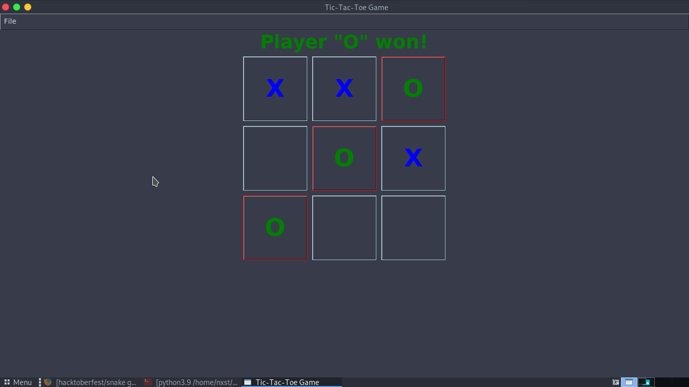
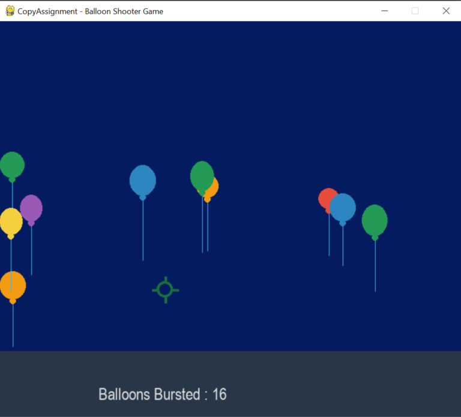
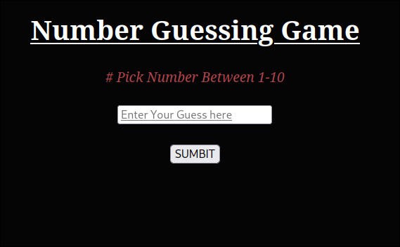

# Hacktober 2023 
## Open to contribute 
## Make a PR with any simple game you have created in any language 

` ⭐ Please star this repo for showing your trust and support ⭐ `

Beginner 🔰 Guide 👇
# How to Make a pull request on github
=> Find a project you want to contribute to.
=> Fork it.
=> Clone it to your local system.
=> Make a new branch.
=> Make your changes.
=> Push it back to your repo.
=> Click the Compare & pull request button.
=> Click Create pull request to open a new pull request.

# How to clone a repositroy on github

1. On GitHub.com, navigate to the main page of the repository.
2. Above the list of files, click  Code.
3. Copy the URL for the repository.
4. Change the current working directory to the location where you want the cloned directory.
5. Type git clone, and then paste the URL you copied earlier.
6. Press Enter to create your local clone.

# You can use any programming language you like 
what we make and count
1. Mini games
2. Cybersecurity Tools
3. Any Python Scripts
4. Any Projects which is cool by any means
5. Telegram/Twitter Bots
6. Cool Websites
7. And at last your own ideas 💡 (just make a issue 😉)

# Non Coded ? we got you 
1. you can contribute in any of the documents 📃 in the repo 

# Rock Paper And Scissors

# Ping Pong Game

# Snake Game 

# Tic-Tak-Toe

# Bubble Shooter

# Number Guess

