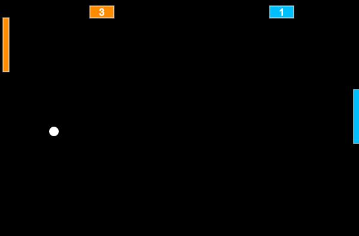

# :tennis: Ping Pong

  

Este é um jogo de *Ping Pong* para dois jogadores desenvolvido em JavaScript.

## :video_game: Instruções

O jogador deve manejar a bola, que ricocheteia ao colidir com alguma extremidada ou raquetes, que ficam nas extremidades do lado esquerdo e direito. Cada um jogador controlará uma das raquetes, o jogador que controlará a raquete do lado esquerdo deverá maneja-lá usando as telas **W** e **S** do teclado, o jogador do lado direito controlará a raquete deste usando as teclas UP (botão para cima) e DOWN (botão para baixo).

O jogador precisa ricochetear a bolinha a ponto que ela colida na lateral da raquete do seu oponente, toda vez que a raquete colidir na lateral do seu oponente, então um ponto será somado para você. Ganha aquele que conseguir a melhor pontuação.

## :sunrise_over_mountains: Publicação

O jogo não está publicado ainda, em breve disponibliizarei-o para jogar diretamente no navegador, no momento apenas baixando o projeto e rodando localmente.

